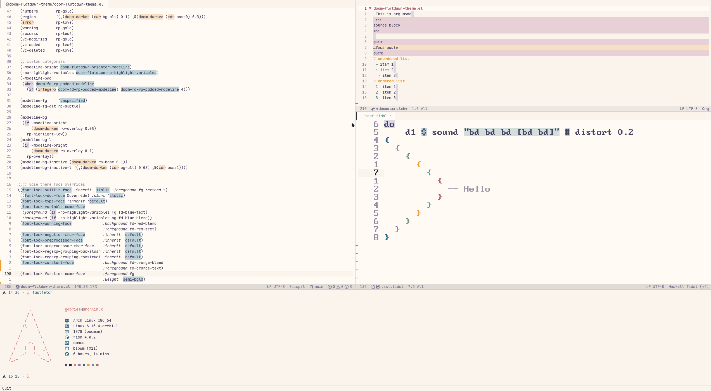

# Document Title

Adaptation of the flatwhite theme using RosePine Dawn colors for Doom Emacs.

# Credits

Credit to Rosé Pine <https://rosepinetheme.com/>, flatwhite-syntax for Atom <https://github.com/biletskyy/flatwhite-syntax> for the colorscheme, and JuneKelly doom-flatwhite-theme.el.

This theme file is a modified version of doom-flatwhite-theme.el by
JuneKelly <https://github.com/JuneKelly>

# Previews

## Flatdawn

